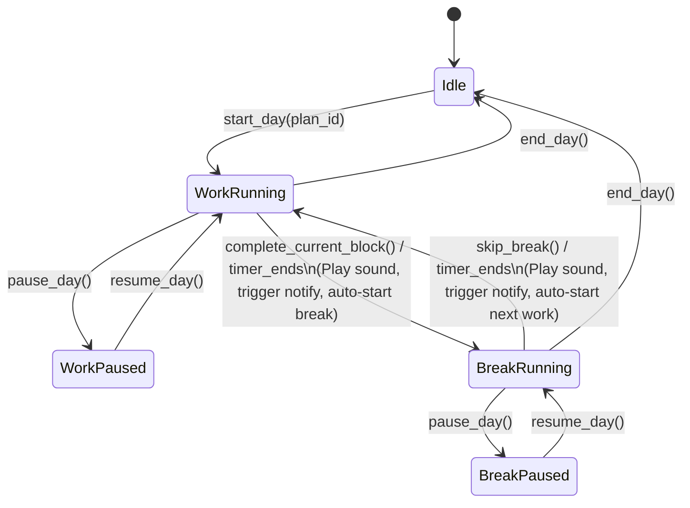

# M1 Focus Planner Design Specification

## 1. Architecture & Technology Stack

**Tech Stack:**
- **Desktop Shell:** Tauri v2
- **Frontend:** Vue 3 + Vite + TypeScript + Pinia
- **Backend (Tauri Core):** Rust with the Domain Core exposed via Tauri IPC commands
- **Database:** SQLite via SQLx (async, compile-time checked queries, and migrations)
- **Styling:** Vanilla CSS + Inter font
- **Logging:** `tracing` + `tracing-subscriber` + `tracing-appender` in Rust — see Section 7 (Observability). Logging is non-negotiable per PHILOSOPHY.md.
- **Audio:** Sounds synthesized in Rust via `rodio` (SineWave sources, no bundled assets); system notifications via the official `tauri-plugin-notification`, called from Rust. Both triggers originate in the Rust runtime engine — routing them through the webview would reintroduce the OS-throttling problem the Rust timer exists to avoid.
- **Sync Stub:** a Rust-side sync seam — a no-op `SyncService` trait inside the Domain Core. The schema stays sync-ready (client-generated UUIDs, `updated_at` on every table, no AUTOINCREMENT). Explicitly **no PowerSync JS SDK**: it manages its own SQLite, which would create a second database in the webview and bypass the Core's single write path. ADR for M3: either load the PowerSync core extension into the SQLx connection, or adopt a PowerSync Rust client SDK if one has matured.

**Architecture Layers:**
```
Vue 3 Frontend (Vite)
  ├── Pinia Stores (project, plan, runtime, pomodoroType)
  ├── Vue Components (views, shared components)
  └── IPC Client (thin wrapper around @tauri-apps/api invoke())
        │
        ▼  Tauri IPC boundary (JSON serialization)
        │
Rust Backend (Tauri Commands)
  ├── commands/ module (IPC handler functions)
  ├── core/ module (Domain Core — business logic, validation)
  │   ├── project_service, goal_service, task_service, microtask_service
  │   ├── pomodoro_type_service
  │   ├── plan_service (deterministic planner)
  │   └── runtime_service (Start Day state machine)
  ├── db/ module (SQLx queries, migrations)
  └── models/ module (Rust structs ↔ DB rows ↔ IPC types)
```

---

## 2. Domain Model & Database Schema

All database timestamps are stored as ISO 8601 UTC strings (`YYYY-MM-DDTHH:MM:SSZ`) to ensure timezone safety. The logical dates for day plans are stored as timezone-naive date strings (`YYYY-MM-DD`).

### SQLite Schema

```sql
-- Projects
CREATE TABLE projects (
    id TEXT PRIMARY KEY,               -- client-generated UUID
    name TEXT NOT NULL,
    description TEXT,
    status TEXT NOT NULL DEFAULT 'open', -- open | completed
    is_archived INTEGER NOT NULL DEFAULT 0,
    completed_at TEXT,
    created_at TEXT NOT NULL,
    updated_at TEXT NOT NULL
);

-- Goals (belong to a project)
CREATE TABLE goals (
    id TEXT PRIMARY KEY,
    project_id TEXT NOT NULL REFERENCES projects(id) ON DELETE CASCADE,
    title TEXT NOT NULL,
    description TEXT,
    deadline TEXT,                      -- ISO 8601, nullable
    priority INTEGER NOT NULL DEFAULT 0,
    sort_order INTEGER NOT NULL DEFAULT 0,
    status TEXT NOT NULL DEFAULT 'open', -- open | completed
    is_archived INTEGER NOT NULL DEFAULT 0,
    completed_at TEXT,
    created_at TEXT NOT NULL,
    updated_at TEXT NOT NULL
);

-- Tasks (belong to a goal)
CREATE TABLE tasks (
    id TEXT PRIMARY KEY,
    goal_id TEXT NOT NULL REFERENCES goals(id) ON DELETE CASCADE,
    title TEXT NOT NULL,
    description TEXT,
    deadline TEXT,
    priority INTEGER NOT NULL DEFAULT 0,
    sort_order INTEGER NOT NULL DEFAULT 0,
    status TEXT NOT NULL DEFAULT 'open', -- open | completed
    is_archived INTEGER NOT NULL DEFAULT 0,
    completed_at TEXT,
    created_at TEXT NOT NULL,
    updated_at TEXT NOT NULL
);

-- Microtasks (the schedulable unit, belong to a task)
CREATE TABLE microtasks (
    id TEXT PRIMARY KEY,
    task_id TEXT NOT NULL REFERENCES tasks(id) ON DELETE CASCADE,
    title TEXT NOT NULL,
    estimated_minutes INTEGER NOT NULL,
    pomodoro_count INTEGER NOT NULL DEFAULT 1,
    pomodoro_type_id TEXT REFERENCES pomodoro_types(id) ON DELETE SET NULL,
    deadline TEXT,
    priority INTEGER NOT NULL DEFAULT 0,
    sort_order INTEGER NOT NULL DEFAULT 0,
    status TEXT NOT NULL DEFAULT 'open', -- open | completed
    is_archived INTEGER NOT NULL DEFAULT 0,
    completed_at TEXT,
    created_at TEXT NOT NULL,
    updated_at TEXT NOT NULL
);

-- Pomodoro Types (presets)
CREATE TABLE pomodoro_types (
    id TEXT PRIMARY KEY,
    name TEXT NOT NULL,
    work_minutes INTEGER NOT NULL,
    rest_minutes INTEGER NOT NULL,
    long_break_minutes INTEGER,         -- nullable
    long_break_every INTEGER,           -- nullable (e.g., every 4 pomodoros)
    is_default INTEGER NOT NULL DEFAULT 0,
    created_at TEXT NOT NULL,
    updated_at TEXT NOT NULL
);

-- Plans (a day plan; exactly one per date — regenerating replaces the draft)
CREATE TABLE plans (
    id TEXT PRIMARY KEY,
    date TEXT NOT NULL UNIQUE,           -- YYYY-MM-DD, one plan per date
    status TEXT NOT NULL DEFAULT 'draft', -- draft | committed
    created_at TEXT NOT NULL,
    updated_at TEXT NOT NULL
);

-- Work Blocks (belong to a plan)
CREATE TABLE work_blocks (
    id TEXT PRIMARY KEY,
    plan_id TEXT NOT NULL REFERENCES plans(id) ON DELETE CASCADE,
    block_type TEXT NOT NULL,            -- task | break | meeting
    microtask_id TEXT REFERENCES microtasks(id) ON DELETE SET NULL,
    calendar_event_id TEXT,              -- M4 event link, nullable
    start_time TEXT NOT NULL,            -- ISO 8601 UTC
    end_time TEXT NOT NULL,              -- ISO 8601 UTC
    pomodoro_index INTEGER,              -- Pomodoro index within the microtask
    sort_order INTEGER NOT NULL DEFAULT 0,
    created_at TEXT NOT NULL,
    updated_at TEXT NOT NULL
);

-- Durable history: Focus Sessions (completed day runs)
CREATE TABLE focus_sessions (
    id TEXT PRIMARY KEY,
    plan_id TEXT NOT NULL REFERENCES plans(id),
    start_time TEXT NOT NULL,
    end_time TEXT NOT NULL,
    total_work_seconds INTEGER NOT NULL,
    total_break_seconds INTEGER NOT NULL,
    blocks_completed INTEGER NOT NULL,
    blocks_skipped INTEGER NOT NULL,
    created_at TEXT NOT NULL
);

-- Durable history: Pomodoro Sessions (individual completed pomodoros)
CREATE TABLE pomodoro_sessions (
    id TEXT PRIMARY KEY,
    focus_session_id TEXT REFERENCES focus_sessions(id),
    microtask_id TEXT REFERENCES microtasks(id),
    pomodoro_type_id TEXT REFERENCES pomodoro_types(id),
    work_minutes INTEGER NOT NULL,
    started_at TEXT NOT NULL,
    completed_at TEXT NOT NULL,
    was_completed INTEGER NOT NULL DEFAULT 1,
    created_at TEXT NOT NULL
);

-- App settings (key-value): planning window, audio volume, notification toggles
CREATE TABLE settings (
    key TEXT PRIMARY KEY,
    value TEXT NOT NULL,
    updated_at TEXT NOT NULL
);
```

### Seed Data

A seed migration inserts the default PomodoroType **"Standard"** (`work_minutes = 20`, `rest_minutes = 5`, `is_default = 1`). If a microtask names no type, the default type applies; if no default type is configured, the planner falls back to 20 minutes of work.

### Runtime State (In-Memory Only)

```rust
pub struct RuntimeState {
    pub active_plan_id: String,
    pub current_block_id: Option<String>,
    pub timer_seconds_remaining: u32,
    pub is_running: bool,
    pub mode: RuntimeMode, // Work | Break | Idle
    pub start_time: Option<String>,
}

pub enum RuntimeMode {
    Work,
    Break,
    Idle,
}
```

---

## 3. Domain Core Commands (Mutations API)

All mutations are handled by Rust backend IPC commands.

**Command-Query Separation (per PHILOSOPHY.md):** commands change state and return only success or a typed error — never data. The UI refreshes by calling the queries in Section 5. Queries never change state.

### Structure Commands
`update_*` commands take no `status` parameter — status changes flow only through the complete/uncomplete commands and the roll-up rule, never through direct writes.

* `create_project(id, name, description?)`
* `update_project(id, name?, description?)`
* `archive_project(id)` · `delete_project(id)`
* `create_goal(id, project_id, title, description?, deadline?, priority?)`
* `update_goal(id, title?, description?, deadline?, priority?)`
* `archive_goal(id)` · `delete_goal(id)`
* `create_task(id, goal_id, title, description?, deadline?, priority?)`
* `update_task(id, title?, description?, deadline?, priority?)`
* `archive_task(id)` · `delete_task(id)`
* `create_microtask(id, task_id, title, estimated_minutes, pomodoro_count, pomodoro_type_id?, deadline?, priority?)`
* `update_microtask(id, title?, estimated_minutes?, pomodoro_count?, pomodoro_type_id?, deadline?, priority?)`
* `complete_microtask(id)` · `uncomplete_microtask(id)`
* `archive_microtask(id)` · `delete_microtask(id)`

**Roll-up rule (lives in the Core, every caller gets it for free):** completing the last open microtask of a task completes the task — inside one transaction — which may in turn complete the goal when its last task completes. `uncomplete_microtask` reverses the roll-up. Estimates and pomodoro counts roll up for display.

### Ranking & Ordering
* `reorder_goals(project_id, ordered_ids)`
* `reorder_tasks(goal_id, ordered_ids)`
* `reorder_microtasks(task_id, ordered_ids)`

### Pomodoro Presets
* `create_pomodoro_type(id, name, work_minutes, rest_minutes, long_break_minutes?, long_break_every?)`
* `update_pomodoro_type(id, name?, work_minutes?, rest_minutes?, long_break_minutes?, long_break_every?)`
* `delete_pomodoro_type(id)`
* `set_default_pomodoro_type(id)`

### Planning Commands
* `generate_day_plan(plan_id, date, strategy?)` — runs the deterministic planner, producing a **draft** plan; regenerating for the same date replaces the existing draft (one plan per date).
* `add_work_block(id, plan_id, block_type, microtask_id?, start, end)` — `microtask_id` is required iff `block_type = 'task'`. `block_type = 'meeting'` is how users add meetings manually in M1 (calendar import arrives in M4); the planner schedules around them.
* `move_work_block(id, new_start, new_end?)` — reschedule.
* `remove_work_block(id)`
* `reorder_work_blocks(plan_id, ordered_ids)`
* `commit_day_plan(plan_id)` · `clear_day_plan(plan_id)`

### Day-Running Commands (desktop-local runtime)
Breaks auto-advance when a work block ends; there is no `start_break` — `skip_break` covers the manual case.
* `start_day(plan_id)`
* `pause_day()` · `resume_day()`
* `complete_current_block()`
* `skip_to_next_block()`
* `skip_break()`
* `end_day()`

### Focus Mode Adapter
* `start_focus_mode(context?)` · `stop_focus_mode()` — M1: no-op stubs that log (see Section 4).

### Settings
* `update_setting(key, value)` — validates against the known-keys registry (planning window, audio, notification settings); unknown keys and out-of-range values are Validation errors.
* `play_test_sound()` — plays the work-end chime at the configured volume (an effect command, returns no data).

### Import / Export
* `export_data()` — writes a versioned single-file JSON dump of all tables, taken from one consistent read snapshot; file picked via the Tauri dialog plugin.
* `import_data(path)` — validates the version field and restores inside one transaction, inserting parents before children.

---

## 4. Planning & Runtime Engine (Rust Backend)

### Day Planner (Deterministic Planner)
The planner generates a schedule for a specific `date` (e.g. `2026-06-09`) within a time window (default 09:00 to 17:00).
1. **Inputs:**
   - Active, uncompleted microtasks, sorted by priority and deadline.
   - Any scheduled meetings (simulated or imported via SQLite query).
2. **Algorithm:**
   - Place meetings/calendar events first at their fixed start/end times.
   - Fill the remaining gaps sequentially with work blocks and rest breaks for the high-priority microtasks.
   - A microtask with $N$ pomodoros is broken down into $N$ separate work blocks, each followed by a break block based on its `PomodoroType` preset.
   - **Long-break rule:** when a microtask's type defines `long_break_every = N`, every Nth consecutive work block of that type gets a break of `long_break_minutes` instead of `rest_minutes`.
   - If a work/break pair cannot fit in a gap, it is scheduled for the next available gap.
   - The planner is a pure function `fn plan(inputs, window, now) -> Vec<BlockSpec>` with persistence kept outside it — this keeps it unit-testable and makes it the LLM's validation door later. The planning window defaults to 09:00–17:00, read from the `settings` table.
3. **Draft State:** The planner saves the output as `WorkBlock`s with a `Plan` in `draft` status.
4. **Modifications:** The user can add, remove, and reorder work blocks, which updates the database.
5. **Commit:** `commit_day_plan(plan_id)` seals the plan and makes it ready for execution.

### Start Day Runtime State Machine
The Start Day runtime is an in-memory engine running in the Rust backend.
- It operates using a background `tokio` task that ticks every 1 second, updating `RuntimeState` and emitting a `runtime-tick` event to the webview.
- **Why in Rust?** Prevents OS throttling of JavaScript timers when the Tauri webview is minimized or in the background.
- **Concurrency model:** the actor pattern, not a shared `Mutex`. One tokio task owns `RuntimeState` exclusively; IPC commands send messages via an `mpsc::Sender<RuntimeCmd>` held in Tauri managed state. The task selects over the command channel and a 1-second `tokio::time::interval`, emitting `runtime-tick` through a captured `AppHandle`. Serializing all transitions through one task eliminates the race between a timer expiry and a simultaneous user command.
- **Block-completion semantics:** each completed work block records a `PomodoroSession` **immediately** (incremental writes, not batched at `end_day`). A microtask with N pomodoros completes only when its last block completes; a "finish microtask early" affordance skips its remaining blocks.
- **Crash semantics:** live runtime state is in-memory and lost on crash — accepted for M1. The plan stays `committed`, and PomodoroSessions already written survive.



### Sound & Notification Rules
The Rust engine triggers these actions automatically at precise times:
1. **5 Minutes Remaining in Work Block:** Sends a system notification: *"5 minutes remaining. Wrap up your current focus item."*
2. **Work Block Ends:**
   - Plays the Pomodoro completion sound (a sequence of two synthesised notes).
   - Sends a system notification: *"Pomodoro completed! Time for a break."*
   - Auto-advances to the next Break block and starts its timer.
3. **1 Minute Remaining in Break Block:** Sends a system notification: *"1 minute remaining. Get ready to focus."*
4. **Break Block Ends:**
   - Plays the break completion sound.
   - Sends a system notification: *"Break ended! Starting next task."*
   - Auto-advances to the next Work block.

### Focus Mode Adapter (The Seam)
Rust command API:
* `start_focus_mode(context)`
* `stop_focus_mode()`
* **M1 Behavior:** Stubs that log to the console. (M2+ will connect to OS-native APIs or helper binaries to block websites/apps).

---

## 5. Queries (Read API)

All reads are Rust read-only IPC commands — the webview cannot reach the Rust-owned SQLite database, and no second access path (e.g. `tauri-plugin-sql`) may be added.
* `list_projects(include_archived: bool)` -> Returns projects with goal/task/microtask completion roll-up stats.
* `get_project_tree(project_id: String)` -> Returns full nested tree: Project → Goals → Tasks → Microtasks.
* `get_microtask(id: String)` -> Returns a single microtask.
* `get_day_plan(date: String)` -> Returns the date's plan (regardless of status) and its ordered work blocks.
* `get_today(date?: String)` -> Returns the **committed** plan, blocks, and meetings for the day (defaults to today).
* `get_run_status()` -> Returns the active `RuntimeState` of the Start Day engine.
* `get_stats(start_date: String, end_date: String)` -> Aggregates focus session logs and completed pomodoros.
* `get_settings()` -> Returns the settings key-value map.

---

## 6. Vue Frontend Layout & Pinia Stores

### Application Layout & Views
The UI is built with Vue 3 using Vanilla CSS for clean, premium styling (dark mode, glassmorphism elements, custom scrollbars, smooth transitions).
1. **Shell Navigation:** A left-hand sidebar switching between major views:
   - **Day View (Primary):** The daily schedule workspace and runtime control center.
   - **Backlog View:** Nested tree-list interface to manage Projects, Goals, Tasks, and Microtasks.
   - **Settings:** Configures defaults, PomodoroType presets, audio levels, and notification triggers.
   - **Analytics:** Shows simple charts/history logs of completed focus sessions.

2. **Day View Layout:**
   - **Timer Header:** Large high-contrast visual timer (countdown) representing the current active block. Indicates state (Work vs. Break, Running vs. Paused).
   - **Controls:** Start Day, Pause, Resume, Skip, and End Day buttons.
   - **Chronological Timeline:** Lists the day's WorkBlocks (Meetings, Tasks, Breaks) with start/end times.
     - While in `draft` mode, supports drag-and-drop reordering, adding work blocks for backlog microtasks, and deleting blocks.
     - While in `committed` or running mode, highlights the active block and marks completed blocks check-marked.

3. **Backlog View (Tree List):**
   - Renders the hierarchical tree structure (Project → Goal → Task → Microtask).
   - Drag-and-drop sorting within each level (translates to `reorder_*` commands).
   - Direct inline creation and quick-estimation inputs for microtasks (setting estimated minutes and auto-computing pomodoro count).

### Pinia Stores

#### `useProjectStore`
- **State:** `projects: Project[]`, `activeProjectTree: ProjectTree | null`.
- **Actions:**
  - `loadProjects()` -> calls `list_projects`.
  - `loadProjectTree(id)` -> calls `get_project_tree`.
  - `create/update/delete` wrappers that execute IPC commands and refresh state.

#### `usePlanStore`
- **State:** `activePlan: Plan | null`, `workBlocks: WorkBlock[]`, `selectedDate: string` (YYYY-MM-DD).
- **Actions:**
  - `loadPlan(date)` -> calls `get_day_plan`.
  - `generatePlan(date, strategy)` -> calls `generate_day_plan`.
  - `commitPlan()` -> calls `commit_day_plan`.
  - `reorderBlocks(orderedIds)` -> calls `reorder_work_blocks` and updates local state immediately for visual responsiveness.

#### `useRuntimeStore`
- **State:** `isRunning: boolean`, `remainingSeconds: number`, `currentBlock: WorkBlock | null`, `mode: RuntimeMode`.
- **Actions:**
  - `initListener()` -> Establishes subscription to Tauri `runtime-tick` events. Updates store state on every tick.
  - `startDay(planId)` -> calls `start_day`.
  - `pauseDay() / resumeDay() / completeBlock() / endDay() / skipBlock()` -> invokes respective backend commands.

---

## 7. Observability & Logging

**The bar (PHILOSOPHY.md):** a junior dev with zero project context must be able to follow a full app run — startup, a backlog edit, a plan generation, a complete Start Day run — from the logs alone.

### Infrastructure
- Rust uses the `tracing` ecosystem. `tracing-subscriber` installs two layers at startup:
  1. **Console layer** — pretty, colored, for the dev terminal.
  2. **File layer** — `tracing-appender` daily-rolling file written to the **exposed Logs folder**: `logs/` at the repo root in dev (gitignored, `.gitkeep` committed), the app-data directory in packaged builds. Plain text, human-readable: `timestamp level target message {structured fields}`.
- Log level via `RUST_LOG` env var; default `info` (file) / `debug` (console in dev).

### What gets logged (rules, enforced from Phase 1 on)
| Source | Level | Content |
|--------|-------|---------|
| Every Core command | INFO | entry: command name + key params (ids, names — never full payloads); exit: `ok` or the error |
| Validation failures | WARN | which rule rejected what input |
| Errors | ERROR | full error + context (what was being attempted) |
| Roll-up rule | INFO | "microtask X completed → task Y completed → goal Z completed" chain |
| Planner | DEBUG | input summary (N microtasks, window, M meetings) and each placement decision ("block placed 09:00–09:20 in gap …", "pair didn't fit, moved to next gap") |
| Runtime engine | INFO | every state transition (`Idle → WorkRunning`, `WorkRunning → BreakRunning` …), block start/complete/skip, sound + notification fired |
| Runtime tick | TRACE | per-second tick (off by default — noise) |
| DB | INFO | migrations applied, DB path on startup |
| Frontend | — | a `log_frontend(level, message, context)` IPC command forwards webview errors and store-action failures into the same log file, tagged `target=frontend` |

### Conventions
- Commands log through a single instrumentation pattern (`#[tracing::instrument]` on command handlers with `skip`-ed payloads and explicit fields) so the format stays uniform — no ad-hoc `println!`.
- One run of the Start Day engine must read as a coherent narrative in the file log: started → each block transition with timestamps → sessions written → day ended.


